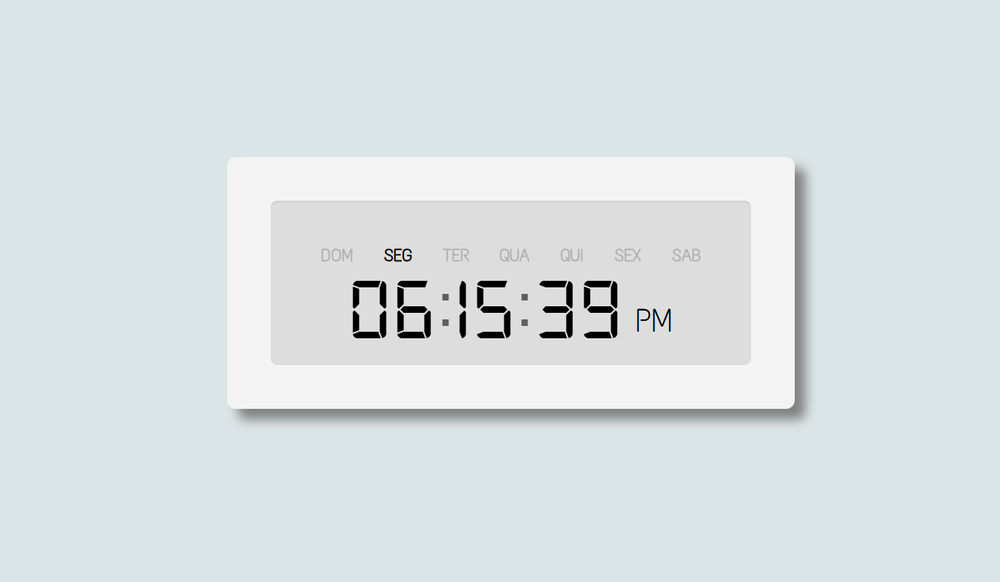

# ⏰ Relógio Digital

Este é um projeto de um relógio digital desenvolvido com HTML, CSS e JavaScript. Ele exibe a hora atual em tempo real, incluindo horas, minutos e segundos.

## 🔗 Link do Projeto

Você pode acessar o projeto online através do seguinte link:  
➡️ [relogio-digital](https://relogio-digital-alpha-beryl.vercel.app)

## 🛠️ Tecnologias Utilizadas

- **HTML5** – Estruturação da página
- **CSS3** – Estilização e layout responsivo
- **JavaScript** – Lógica para atualização em tempo real do relógio

## ⚙️ Funcionalidades

- Exibição da hora atual com atualização a cada segundo
- Design responsivo que se adapta a diferentes tamanhos de tela
- Interface simples e intuitiva

## 📁 Estrutura do Projeto

O projeto é composto pelos seguintes arquivos:

- `index.html` – Estrutura principal do relógio
- `style.css` – Estilização do relógio e responsividade
- `script.js` – Script responsável por atualizar o relógio em tempo real
- `Digital-7, Text Me One` – Fonte personalizada utilizada no projeto

## 🚀 Como Usar

1. Clone este repositório ou baixe o código
2. Abra o arquivo `index.html` em um navegador de sua escolha
3. O relógio será exibido e atualizado a cada segundo automaticamente

## 📷 Demonstração

## 🧑‍💻 Autor

- **Nome:** Mário Costa
- **GitHub:** [@mariocosta-ao](https://github.com/mariocosta-ao)

---

Sinta-se à vontade para contribuir ou sugerir melhorias!
